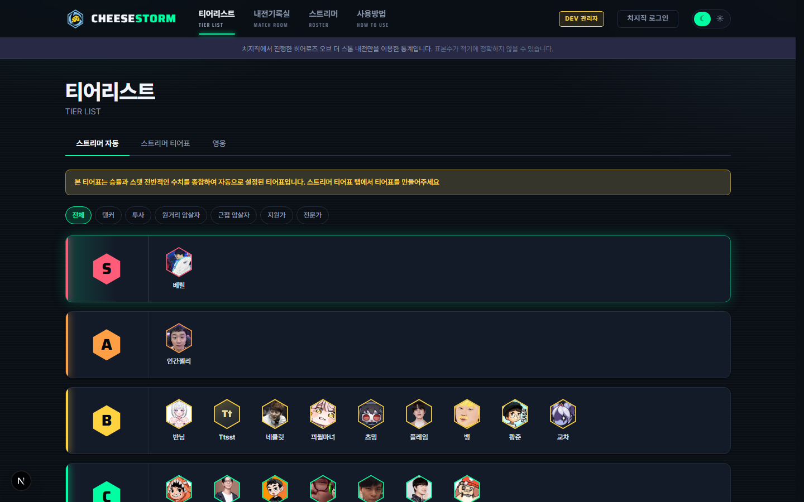
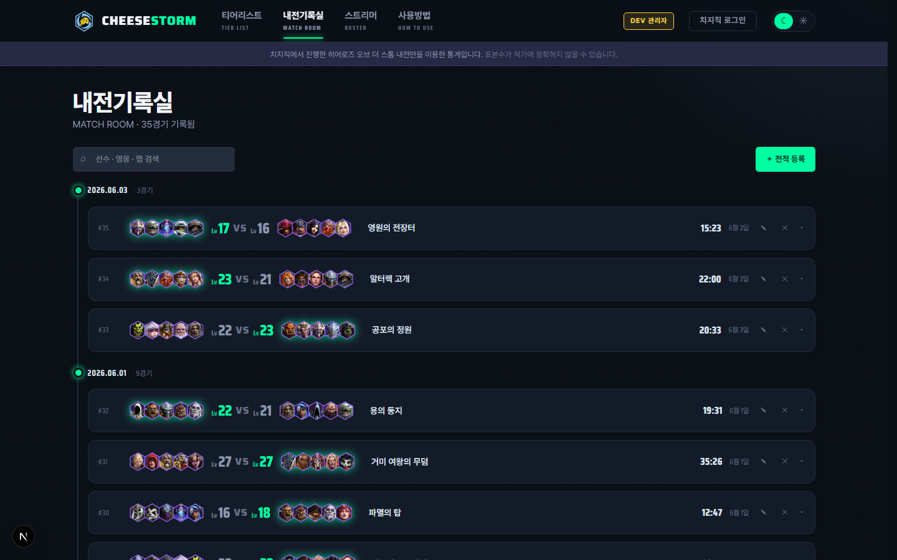
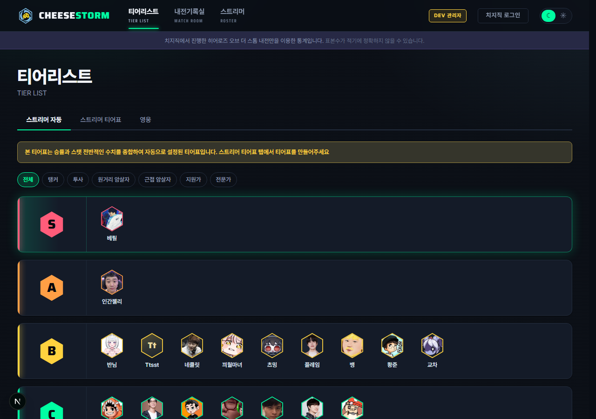
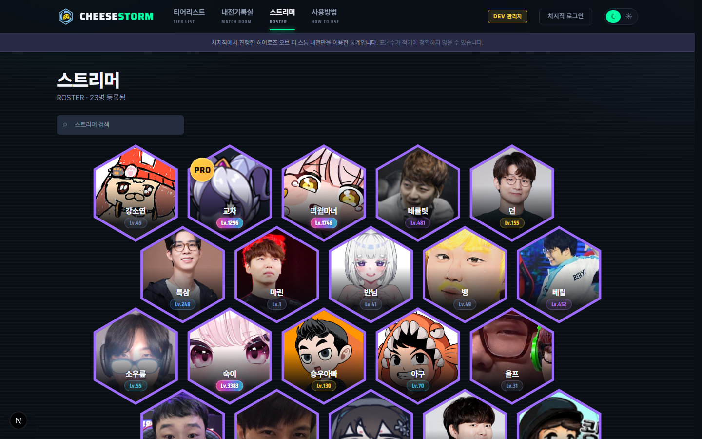
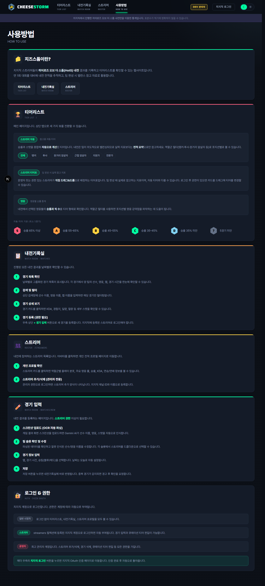

# CHEESESTORM

> 치지직 스트리머들의 히어로즈 오브 더 스톰(HotS) 내전 전적 기록 & 티어리스트 서비스

## 스크린샷

|         홈 (티어리스트)          |                 경기 기록                  |                   경기 입력                    |
| :------------------------------: | :----------------------------------------: | :--------------------------------------------: |
|  |  |  |

|                스트리머 목록                |                가이드                 |
| :-----------------------------------------: | :-----------------------------------: |
|  |  |

## 기능

- **티어리스트** — 자동 티어(승률+스탯) / 큐레이션 티어(운영자 직접 배정) / 영웅 티어
- **내전 기록** — 경기 결과 입력 (스크린샷 OCR 지원)
- **스트리머 프로필** — 개인 전적, 역할군 분포, 영웅 풀
- **치지직 OAuth** — 권한별 기능 제어 (시청자/스트리머/운영자)

## 기술 스택

| 항목         | 사용 기술                            |
| ------------ | ------------------------------------ |
| 프레임워크   | Next.js 15 (App Router)              |
| 언어         | TypeScript                           |
| 데이터베이스 | Firebase Firestore (Spark 무료 플랜) |
| 스타일       | Tailwind CSS v4 + shadcn/ui          |
| 인증         | 치지직 OAuth 2.0 + jose JWT          |
| AI/OCR       | Google Gemini API                    |
| 배포         | Vercel                               |

## 시작하기

### 환경 설정

```bash
cp .env.local.example .env.local
```

`.env.local`에 다음 값을 채워주세요:

- Firebase 프로젝트 설정값
- Gemini API 키
- 치지직 OAuth 클라이언트 ID/Secret

### 개발 서버 실행

```bash
npm install
npm run dev
```

[http://localhost:3000](http://localhost:3000)에서 확인.

## Firebase 설정

1. [Firebase 콘솔](https://console.firebase.google.com)에서 새 프로젝트 생성
2. Firestore Database → 프로덕션 모드로 생성
3. 웹 앱 추가 → SDK 설정값을 `.env.local`에 복사
4. Firestore 보안 규칙을 서비스 성격에 맞게 설정

## 설계 판단

### 왜 Firebase Spark(무료 플랜)인가

연 2-3주만 활발히 운영되는 서비스 특성상 대부분의 기간은 트래픽이 0에 가깝다. RDS나 Supabase처럼 상시 과금되는 구조 대신, 유휴 시 비용이 0원인 Firebase Spark 플랜을 선택했다. 트래픽 스파이크 대비는 Firestore 자체의 자동 스케일링으로 해결한다.

### 왜 NextAuth를 쓰지 않았나

치지직(CHZZK)은 NextAuth가 기본 지원하지 않는 플랫폼이다. 커스텀 프로바이더를 작성하면 NextAuth의 세션 모델·콜백 구조에 맞춰야 하는 제약이 생긴다. 대신 치지직 OAuth 2.0 흐름을 직접 구현하고 `jose`로 JWT를 발급해 쿠키에 저장하는 방식을 택했다. 의존성이 줄고 토큰 구조를 완전히 제어할 수 있다.

치지직 API는 표준 OAuth와 달리 토큰 교환 응답을 `{ content: { accessToken: "..." } }` 래퍼로 감싸서 반환한다. 표준 OAuth를 가정하고 `res.json()`을 그대로 쓰면 `accessToken`이 `undefined`가 되어 이후 유저 정보 조회에서 401이 발생한다. 유저 정보 조회 엔드포인트도 같은 래퍼 구조를 사용하므로, 모든 응답에서 `data.content ?? data`로 언래핑하는 패턴을 통일했다.

### 왜 승률만으로 티어를 정하지 않나

내전은 실력이 비슷하도록 팀을 의도적으로 밸런싱한다. 이 구조에서는 전프로도 운이 나쁘면 C티어에 배정될 수 있다. 이를 보완하기 위해 승률과 역할별 스탯 점수를 가중 평균한 혼합 점수를 사용하되, 자동 티어 자체를 "참고용"으로 위치시키고 운영자가 직접 배정하는 큐레이션 티어를 실제 팀 편성 기준으로 분리했다.

> **자동 티어는 참고용입니다.** 내전은 실력이 비슷하도록 팀을 구성하므로 승률만으로 개인 실력 측정에 한계가 있습니다. 실제 팀 편성 시 큐레이션 티어를 참고하세요.

## 저작권 안내

본 프로젝트의 소스 코드는 자유롭게 참고할 수 있습니다.  
단, Heroes of the Storm은 Blizzard Entertainment의 상표이며, 게임 관련 에셋의 저작권은 Blizzard Entertainment에 있습니다.
