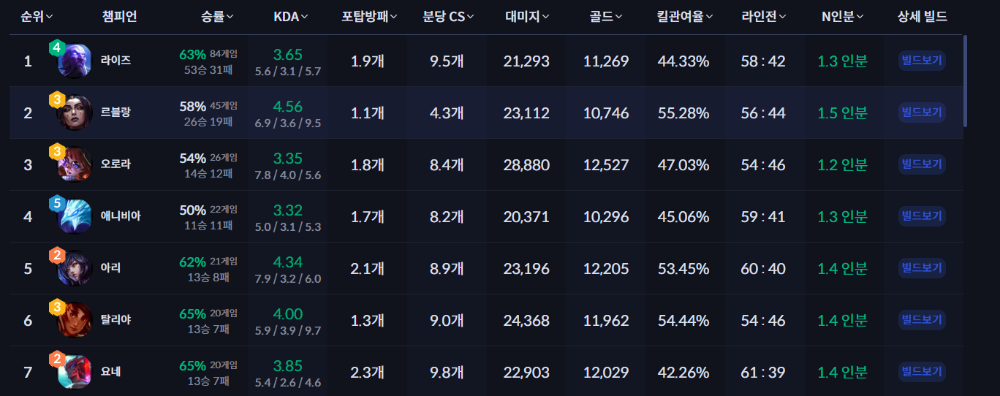
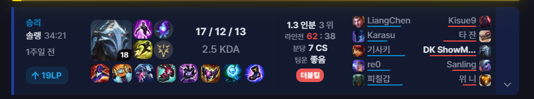

티어리스트에 검색 기능 삭제
내전기록실에 분류기능 삭제

스트리머페이지 가나다순 정렬

상세 페이지 프로필 부분에도 육각형 프로필로 대체
계정 레벨을 주요 정보로 보이도록

상세 페이지에 현제 항목은 개요로 하고 내전에서 사용한 모든 영웅을 확인할 있는 영웅 페이지로 전환할 수 있도록 을 참조
최근 매치만 아니라 전모든 매치 확인할 수 있도록
최근 매치 전적 바를  의 라운드 없는 왼쪽 바, 그리고 승패에 따라 바의 색을 변화시키고 승,패 글자 박스를 없앨것

kda와 딜수치 더미데이터에 추가

내전기록실에서 항목 확장시켰을 때 상세스텟 확인할 수 있도록
내전 기록시 진형 불명확할 수 있음 반영

사용한 캐릭터에 따라 선호 포지션이 반영되도록

상세페이지 개요에 같이 하면 시너지 나는 팀원, 만나면 까다로운 상대 나오는 로직설계 및 제작
맵별 승률 나오는 로직

판단 데이터 부족 시 데이터 부족 텍스트 출력

내전 결과에 따른 영웅의 티어리스트도 볼 수 있도록 로직설계 ui 제작
스트리머 티어리스트는 수동 조작 가능하도록
스트리머 티어리스트에 에이펙스 같은 부가 문구 삭제
티어리스트에 스트리머 클릭 시 상세 페이지로 가도록

다양한 요구를 반영할 수 있는 db 설계

창 작아짐을 반영할 수 있는 반응형페이지 제작
